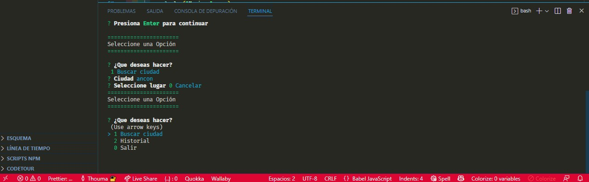
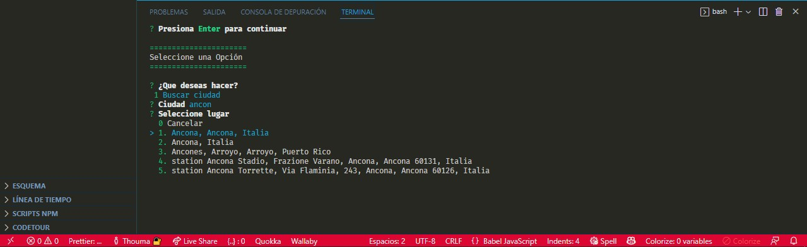
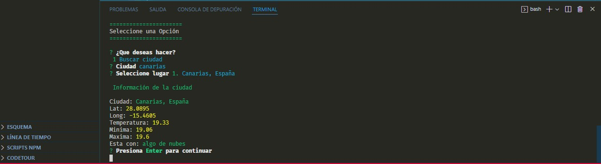

# Aplicación de linea de Comandos

- Aplicación de consola interactiva con menú y listado dinámico personalizado
- Inquirer para la interacción con el usuario
- consumo de Api para las coordenadas de la ciudad elegida
- consumo de Api para el clima

## Dependencias

    npm i axios
    npm i colors
    npm i dotenv
    npm i inquirer

## vista previa

---

---

---

## Tema de VS code

Winter is Coming (dark black)
